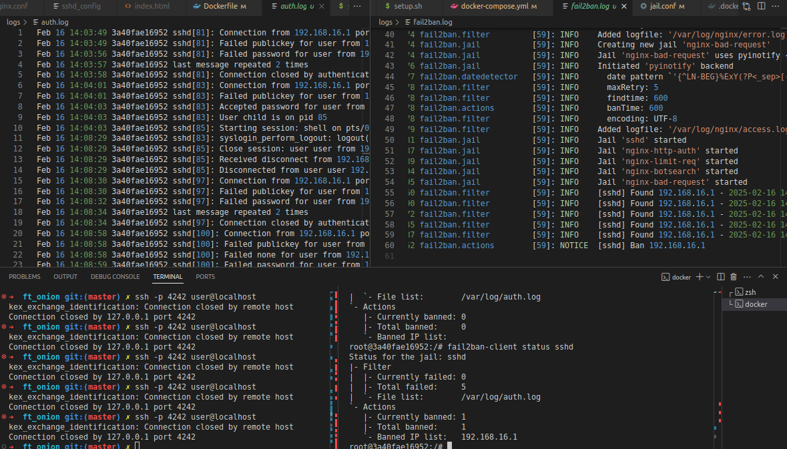
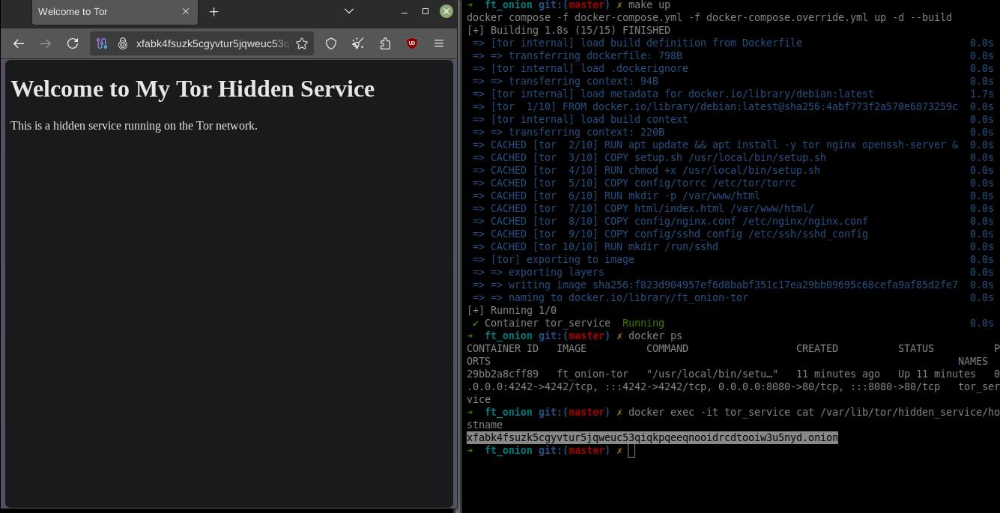

# ft_onion 

## **Description**
This project sets up a **Tor hidden service** running inside a Docker container with **Nginx** for web hosting and **SSH access**.<br /><br />

It supports **two modes**:  
1. **Persistent mode**: Keeps the same `.onion` address across restarts.  
2. **Non-persistent mode**: Generates a new `.onion` address each time.  

---

## **Setup instructions**

### Requirements
- Docker
- Docker Compose
- Make<br />
etc

### **1️. Clone the repository**
```sh
git clone https://github.com/daisvke/ft_onion.git
cd ft_onion
```

### **2️. Configure environment variables**
Create a `.env` file from the example:  
```sh
cp .env.example .env
```
Then edit `.env` as needed.

### **3️. Build the image and run the container**
#### **🔸 Persistent Onion address**
You will need this structure (from /var/lib/tor/hidden_service/) to run it with hostname persistence:
```sh
├── tor_data
│   ├── authorized_clients
│   ├── hostname
│   ├── hs_ed25519_public_key
│   └── hs_ed25519_secret_key

# Run:
make up
```
This will keep the same **.onion** address across restarts.  

#### **🔹 Non-persistent Onion address**
```sh
make nonpersist
```
A new **.onion** address will be generated on every restart.

```sh
docker compose down
# Or
make clean
# Or do a full clean:
make fclean
```
These will remove the `.onion` address.

#### **Persistent logs**
You will need this structure for logs persistence:
```sh
├── logs
│   ├── auth.log
│   └── fail2ban.log
```
---

## **Accessing the services**

### **Find Your `.onion` Address**
After starting the container, check your **Tor Hidden Service address**:  
```sh
docker exec -it tor_service cat /var/lib/tor/hidden_service/hostname
```
Use **Tor Browser** to visit the site.

### **SSH into the container (2 modes)**
- When using `SSH (Secure Shell)` to connect to remote servers, there are two primary modes of operation you can consider: **Direct SSH Connection** and **SSH over Tor (using torsocks)**.

- `torsocks` is a wrapper for applications that need to connect to the internet through the Tor network. It allows these applications to route their traffic through Tor, providing anonymity and privacy for the user.<br />

#### **1. To connect via SSH over Tor using torsocks**
```bash
# Install torsocks
sudo apt install torsocks
# Set up a Tor connection
sudo tor
# Connect to the server via SSH through the Tor network
torsocks ssh <SSH_USER>@<your-hidden-service.onion> -p 4242
```

* **Pros**:
	- **Anonymity**: Connecting through Tor provides anonymity for both the client and the server. The server's IP address is not exposed to the client.
	- **Access from Anywhere**: You can access the server from anywhere without needing to expose your server's IP address to the public internet.

* **Cons**:
    - **Latency**: Tor can introduce additional latency due to the multiple hops your connection makes through the Tor network.

#### **2. Using Direct SSH to the server's IP Address**
```bash
# Execute bash from the container
docker exec -it tor_service /bin/bash

# Connect to the container via SSH from the host
ssh -p 4242 <SSH_USER>@localhost
# Ex.:
ssh -p 4242 user@localhost

# Connect from another device on the same network
ssh -p 4242 <SSH_USER>@<TOR_SERVICE_HOST_PRIVATE_IP>
# Ex.:
ssh -p 4242 user@192.168.43.67
```

* **Pros**:
    - **Performance**: A direct SSH connection to an IP address typically offers better performance and lower latency.

* **Cons**:
    - **Exposure**: The server's IP address is exposed, which can make it a target for attacks. If the server is on a public network, it may be vulnerable to scanning and unauthorized access.
    - **Limited Access**: If you're trying to access the server from outside the local network, you may need to configure port forwarding on your router or use a VPN.

#### SSH fortification
We secured the SSH service against attacks by adding to our `sshd_config` file:
```sh
# Disable root login: Prevent attackers from trying to log in as root.
PermitRootLogin no
# Allow only specific users to log in via SSH
AllowUsers user
```

**2. Enable verbose logging**:
```sh
# Install syslog (from Dockerfile)
apt update && apt install -y inetutils-syslogd

# Run syslog (from script.sh)
syslogd

# Add in `sshd_config`:
SyslogFacility AUTH
LogLevel VERBOSE  # With `INFO` we didn't get any SSH access logs

# Check logs
docker exec -it tor_service cat /var/log/auth.log
```

**3. Prevent brute-force attacks by banning IPs after failed login attempts (Fail2ban)**:
```sh
# Install Fail2ban
apt update && apt install -y fail2ban

# Edit config file
vim config/jail.conf

# We need to add a capability on the docker compose file
# to run the container with networking permissions.
# This is because `iptables` doesn't run without those permissions.
cap_add:
	- NET_ADMIN

# In jail.conf we must have:
[sshd]

port    = 4242
logpath = %(sshd_log)s
backend = %(sshd_backend)s

# Run Fail2ban
service fail2ban start

# Check status (total failed, total banned, etc)
fail2ban-client status sshd

# Display logs
cat /var/log/fail2ban.log
```


The address `192.168.16.1` is being banned.

**4. Use Key-Based Authentication**:
    - Generate an SSH key pair on your local machine:
	```sh
    ssh-keygen
	```

    - Copy the public key to the remote server:

	```sh
    ssh-copy-id user@remote_server
	# Ex.: ssh-copy-id user@localhost
	```
    - This will add an entry to `/home/user/.ssh/authorized_keys` in the container, and to `config/ssh/authorized_keys` on the host machine. Now the client can connect automatically to the server without having tolog in.

    - Disable password authentication in the /etc/ssh/sshd_config file:

	```sh
	PasswordAuthentication no
	```

##### **Accessing through Tor socket**
In our case `Fail2Ban` wasn't detecting SSH login failures over Tor socket. This is because of how Tor handles connections and how Fail2Ban reads logs:
  - when using Tor, **all connections appear to come from 127.0.0.1 (localhost)** because Tor is **forwarding** the request.
  - Therefore, we needed to ignore login failures coming from the localhost:
  ```
  ignoreip = 127.0.0.1/8 ::1
  ```
  `::1` is the **IPv6 loopback address**, equivalent to `127.0.0.1` in **IPv4**.

### About HTTPS and the Tor network
You do not need `HTTPS` for a Tor `.onion` website because Tor already **encrypts all traffic end-to-end**. Unlike the regular internet, where HTTPS is needed to prevent MITM (Man-in-the-Middle) attacks, Tor's network ensures that:	
  - End-to-end encryption is built into the protocol.
  - No need for TLS/SSL certificates (Let's Encrypt does not issue .onion certs).
  - Traffic is encrypted between the client and the hidden service.
  - When you are hosting a .onion Hidden Service, nobody (including exit nodes) can see your traffic because it stays inside the Tor network.
---

## Useful commands
```sh
# Check the used ports inside the container with the corresponding processes
docker exec -it tor_service ss -tulnp

# Check ports of the container that are open to the outside
docker ps
# or
docker port <CONTAINERR ID>
```

## Screenshot


## References
* [Set up Your Onion Service (torproject.org)](https://community.torproject.org/onion-services/setup/)
* [docker-compose reference YAML file with comments](https://gist.github.com/ju2wheels/1885539d63dbcfb20729)