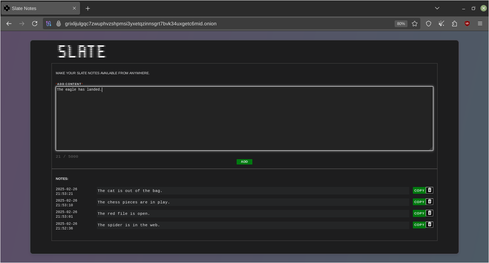
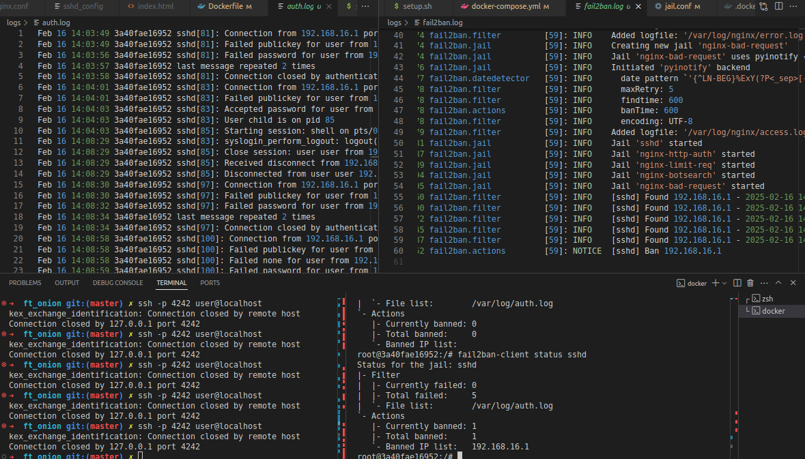
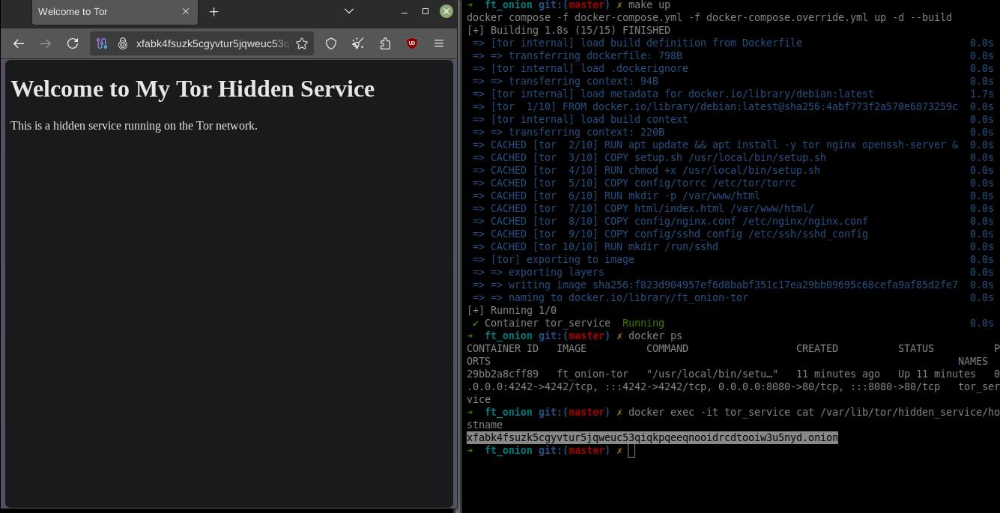

# ft_onion 

## **Description**
This project sets up a **Tor hidden service** running inside a secured Docker container with **Nginx** for web hosting and **SSH access**. The website hosted is called **Slate Notes**, which is a platform where users can write and store secret notes securely. This setup ensures that all communications are anonymized and protected, allowing users to maintain their privacy while managing their sensitive information.<br /><br />

It supports **two modes**:  
1. **Persistent mode**: Keeps the same `.onion` address across restarts.  
2. **Non-persistent mode**: Generates a new `.onion` address each time.  


---

## **Setup instructions**

### Requirements
- Docker
- Docker Compose
- Make<br />

### **1. Clone the repository**
```sh
git clone https://github.com/daisvke/ft_onion.git
cd ft_onion
```

### **2. Configure environment**
#### **Adapt port numbers**
If you get the following error:
```
listen tcp4 0.0.0.0:4242: bind: address already in use
```
Use a host port that is available by modifying the following macro from the `.env` file:
```
PORT_HOST_SSH=4243
```

#### **.env files to create**
Create a `.env` file from the example:  
```sh
# For ft_onion 
cp .env.example .env

# For Slate Note
cp html/slate/.env.example html/slate/.env
```
Then edit `.env` files as needed.

#### **Log files to create**
You will need this structure for log persistence:
```sh
├── logs
│   ├── auth.log
│   └── fail2ban.log
```

#### **SSH file to create**
This one for the persistence of the authorized SSH keys:

```sh
├── config
│   ├── ssh
│   │   └── authorized_keys
```
Here copy-paste the SSH keys (one key = one line) of the devices which SSH connections are authorized.

#### Website intergration
By default, we have our Slate Notes website hosted on the container,
but you can add any other PHP or HTML website using the default configuration.
Just place your web project at `html/my_project` and replace `slate` by `my_project` on configuration and Docker files.

#### These files can be empty, just create them using:
```sh
# On Unix
touch logs/auth.log logs/fail2ban.log config/ssh/authorized_keys

# On Windows
New-Item -Path "logs/auth.log", "logs/fail2ban.log", "config/ssh/authorized_keys" -ItemType File
```

### 3. **Build the image and run the container**

Now that we have all the necessary empty files, we have two modes in which we can run this project:

#### **1. Persistent Onion address**
- You will need this structure (from /var/lib/tor/hidden_service/) to run it with hostname persistence:
```sh
├── tor_data
    ├──hidden_service
    ├──saved_hidden_service
        ├── authorized_clients
        ├── hostname # Contains the .onion address 
        ├── hs_ed25519_public_key
        └── hs_ed25519_secret_key
```

- If you run the project for the first time, you will need to populate `tor_data/saved_hidden_service`:
```sh
# Run the container. This will generate the necessary files in the container.
make

# Export the hidden_service files from the container to the host (`tor_data/hidden_service_export/`)
make tor-export

# The files then need to be saved in the host folder `tor_data/saved_hidden_service/`.
cp tor_data/hidden_service_export tor_data/saved_hidden_service
```
- Then, or if you already have the files in the right place, do:
```sh
make
```
To start the project and Tor with the saved parameters.<br />
This will keep the same **.onion** address across restarts.  

#### **2. Non-persistent Onion address**
```sh
make nonpersist

# Or, if `tor_data/saved_hidden_service/` is empty:
make
```
A new **.onion** address will be generated on every restart.

```sh
docker compose down
# Or
make clean
# Or do a full clean:
make fclean
```
These will remove the `.onion` address across restarts.

---

## **Accessing the services**

### **Find Your `.onion` Address**
After starting the container, check your **Tor Hidden Service address**:  
```sh
docker exec -it tor_service cat /var/lib/tor/hidden_service/hostname
```
Use **Tor Browser** to visit the site.

### **SSH into the container (2 modes)**
- When using `SSH (Secure Shell)` to connect to remote servers, there are two primary modes of operation you can consider: **Direct SSH Connection** and **SSH over Tor (using torsocks)**.

- `torsocks` is a wrapper for applications that need to connect to the internet through the Tor network. It allows these applications to route their traffic through Tor, providing anonymity and privacy for the user.<br />

Here’s the corrected version of your statement for clarity and accuracy:

- **To use either of the two connection modes you can**:
  - Add the SSH key of the device you want to connect from to the `authorized_keys` file on the host. This will automatically connect the device on login.
  - Or, in `config/ssh/sshd_config`, change the following line:
  ```
  PasswordAuthentication no
  ```
  to `yes`. This will allow SSH connection with a password authentication.

#### **1. To connect via SSH over Tor using torsocks**
```bash
# Install torsocks
sudo apt install torsocks
# Set up a Tor connection
sudo tor
# Connect to the server via SSH through the Tor network
torsocks ssh <SSH_USER>@<ONION_ADDRESS> -p <PORT_TOR_SSH> # This is the port given in `torrc` host file
```

* **Pros**:
	- **Anonymity**: Connecting through Tor provides anonymity for both the client and the server. The server's IP address is not exposed to the client.
	- **Access from Anywhere**: You can access the server from anywhere without needing to expose your server's IP address to the public internet.

* **Cons**:
    - **Latency**: Tor can introduce additional latency due to the multiple hops your connection makes through the Tor network.

#### **2. Using Direct SSH to the server's IP Address**
```bash
# Execute bash from the container
docker exec -it tor_service /bin/bash

# Connect to the container via SSH from the host
ssh -p <PORT_HOST_SSH> <SSH_USER>@localhost
# Ex.:
ssh -p 4242 user@localhost

# Connect from another device on the same network
ssh -p <PORT_HOST_SSH> <SSH_USER>@<TOR_SERVICE_HOST_PRIVATE_IP>
# Ex.:
ssh -p 4242 user@192.168.43.67
```

* **Pros**:
    - **Performance**: A direct SSH connection to an IP address typically offers better performance and lower latency.

* **Cons**:
    - **Exposure**: The server's IP address is exposed, which can make it a target for attacks. If the server is on a public network, it may be vulnerable to scanning and unauthorized access.
    - **Limited Access**: If you're trying to access the server from outside the local network, you may need to configure port forwarding on your router or use a VPN.

#### **Check connections**
Connections can be checked with the `w` command from the container:
```
root@x:/# w
 13:22:22 up 19:20,  2 users,  load average: 0.41, 0.66, 0.71
USER      TTY      FROM             LOGIN@   IDLE   JCPU    PCPU WHAT
user1     pts/0    172.18.0.1       13:20    1:26   0.00s   ?    -bash
user2     pts/1    127.0.0.1        13:22    4.00s  0.00s   ?    -bash
```
- Here `user1` is connected with a regular SSH connection and `user2` with a SSH over Tor connection.
- It says `user2` is connected from localhost 127.0.0.1 because we have in `torrc`:
```
HiddenServicePort 4242 127.0.0.1:4242
```
This tells the Tor service to direct connections from the Tor network to port 4242 of the local service. 

#### SSH fortification
We secured the SSH service against attacks by adding to our `sshd_config` file:
```sh
# Disable root login: Prevent attackers from trying to log in as root.
PermitRootLogin no
# Allow only specific users to log in via SSH
AllowUsers user
```

**2. Enable verbose logging**:
```sh
# Install syslog (from Dockerfile)
apt update && apt install -y inetutils-syslogd

# Run syslog (from script.sh)
syslogd

# Add in `sshd_config`:
SyslogFacility AUTH
LogLevel VERBOSE  # With `INFO` we didn't get any SSH access logs

# Check logs
docker exec -it tor_service cat /var/log/auth.log
cat /var/run/utmp
```

**3. Prevent brute-force attacks by banning IPs after failed login attempts (Fail2ban)**:
```sh
# Install Fail2ban
apt update && apt install -y fail2ban

# Edit config file
vim config/jail.conf

# We need to add a capability on the docker compose file
# to run the container with networking permissions.
# This is because `iptables` doesn't run without those permissions.
cap_add:
	- NET_ADMIN

# In jail.conf we must have:
[sshd]

port    = 4242
logpath = %(sshd_log)s
backend = %(sshd_backend)s

# Run Fail2ban
service fail2ban start

# Check status (total failed, total banned, etc)
fail2ban-client status sshd

# Display logs
cat /var/log/fail2ban.log

# Ban the IP Address
fail2ban-client set <JAIL_NAME> banip <IP_ADDRESS>

# Unban the IP Address
fail2ban-client set <JAIL_NAME> unbanip <IP_ADDRESS>
```


The address `192.168.16.1` is being banned.

**4. Use Key-Based Authentication**:<br />
- If not done yet, generate an SSH key pair on your local machine:
```sh
ssh-keygen
```
- Copy the public key to `config/ssh/authorized_keys` on the host machine

```sh
{ printf "\n"; cat ~/.ssh/id_rsa.pub; } >> ./config/ssh/authorized_keys
```
- This will add an entry to `/home/user/.ssh/authorized_keys` in the container, and to `config/ssh/authorized_keys` on the host machine. Now the client can connect automatically to the server without having to log in.

- Disable password authentication in the /etc/ssh/sshd_config file:

```sh
PasswordAuthentication no
```
Put back `yes` if you want to register a new user.

##### **To unlog a user from its SSH connection**
```sh
# find the PID of the process managing the SSH session
ps aux | grep ssh
# Kill the process
kill <PID>
# Connection is then closed
```

##### **Accessing through Tor socket**
In our case `Fail2Ban` wasn't detecting SSH login failures over Tor socket. This is because of how Tor handles connections and how Fail2Ban reads logs:
  - when using Tor, **all connections appear to come from 127.0.0.1 (localhost)** because Tor is **forwarding** the request.
  - Therefore, we needed to ignore login failures coming from the localhost:

  ```sh
  # In `jail.conf`:
  ignoreip = 127.0.0.1/8 ::1
  ```
  `::1` is the **IPv6 loopback address**, equivalent to `127.0.0.1` in **IPv4**.

### About HTTPS and the Tor network
You do not need `HTTPS` for a Tor `.onion` website because Tor already **encrypts all traffic end-to-end**. Unlike the regular internet, where HTTPS is needed to prevent MITM (Man-in-the-Middle) attacks, Tor's network ensures that:	
  - End-to-end encryption is built into the protocol.
  - No need for TLS/SSL certificates (Let's Encrypt does not issue .onion certs).
  - Traffic is encrypted between the client and the hidden service.
  - When you are hosting a .onion Hidden Service, nobody (including exit nodes) can see your traffic because it stays inside the Tor network.
---

## Useful commands
```sh
# Check logs from the container
docker logs tor_service

# Copy a local file into container
docker cp ./some_file tor_service:/work
# Copy files from container to local path
docker cp tor_service:/var/logs/ /tmp/app_logs

# Check the used ports inside the container with the corresponding processes
docker exec -it tor_service ss -tulnp

# Check ports of the container that are open to the outside
docker ps
# or
docker port <CONTAINER ID>

# Check Nginx config file syntax and run test
docker exec -it tor_service nginx -t

# Start a tiny temporary container, give it access to the current directory,
# delete tor_data from inside the container, then throw the container away
docker run --rm -v $(pwd):/data busybox rm -rf /data/tor_data
```

## Screenshot


## References
* [Set up Your Onion Service (torproject.org)](https://community.torproject.org/onion-services/setup/)
* [docker-compose reference YAML file with comments](https://gist.github.com/ju2wheels/1885539d63dbcfb20729)
